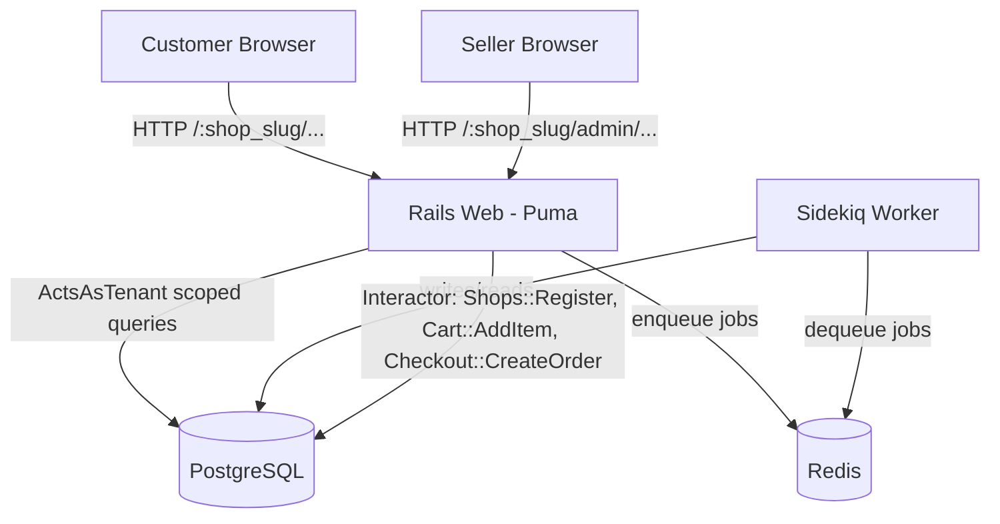
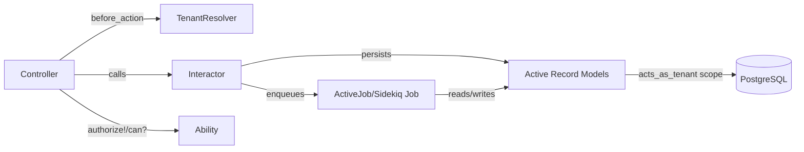
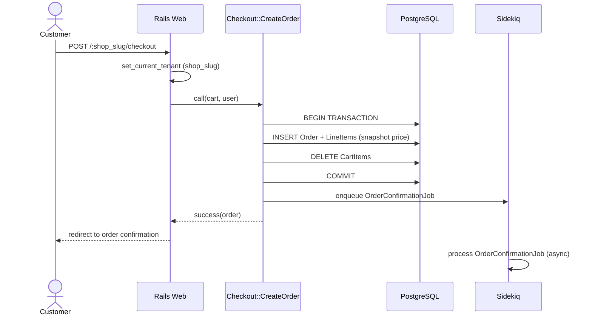

# Web E-Commerce Multi-Tenant Architecture Document

## Introduction

Este documento define a arquitetura técnica da plataforma de e-commerce multi-tenant descrita em `docs/prd.md`. Não há starter template ou codebase pré-existente além do scaffold padrão `rails new` (Rails 8.0.5 / Ruby 3.2.8) — a arquitetura é greenfield a partir daqui, restrita pelas decisões de stack já aprovadas no PRD (Technical Assumptions).

### Starter Template or Existing Project

N/A — apenas o scaffold padrão do Rails 8 (`pg`, `puma`, `propshaft`, `turbo-rails`, `stimulus-rails`, `jbuilder`, `solid_cache/queue/cable`, `kamal`, `brakeman` já presentes no Gemfile). Nenhum boilerplate externo será adotado.

### Change Log

| Date | Version | Description | Author |
|------|---------|-------------|--------|
| 2026-06-17 | 0.1 | Versão inicial, derivada de `docs/prd.md` e das decisões de plano (acts_as_tenant, roteamento por path). | @architect (Aria) |

## High Level Architecture

### Technical Summary

A aplicação é um **monólito Rails 8 server-rendered** (ERB + Bootstrap + Turbo/Stimulus), com um processo web (Puma) e um worker assíncrono (Sidekiq) compartilhando a mesma base de código. Multi-tenancy é implementada via **isolamento de dados em linha** (`acts_as_tenant`, escopando toda query por `shop_id`), com o tenant resolvido a partir do segmento `:shop_slug` na URL — sem subdomínios. Autenticação é feita via Devise (modelo único `User` com `role` enum) e autorização via CanCanCan (`Ability` ramificando por `role` e validando `shop_id`). Lógica de negócio não-trivial é encapsulada em objetos `Interactor`. Todo dado de negócio persiste em PostgreSQL; Redis serve exclusivamente como broker do Sidekiq. Essa arquitetura sustenta diretamente os goals do PRD: isolamento entre vendedores, simplicidade operacional (sem N schemas/serviços), e testabilidade desde a Epic 1.

### High Level Overview

1. **Estilo arquitetural:** Monolito modular (não microsserviços, não serverless) — adequado ao escopo "e-commerce simples" do PRD.
2. **Estrutura de repositório:** Monorepo (decisão do PRD) — uma única aplicação Rails.
3. **Arquitetura de serviço:** Processo `web` (Puma, HTTP) + processo `worker` (Sidekiq, jobs assíncronos), ambos lendo o mesmo código-fonte e mesmo banco PostgreSQL; `redis` como broker compartilhado entre eles.
4. **Fluxo de dados/interação principal:** Cliente acessa `/:shop_slug/...` → `ApplicationController` resolve `Shop` pelo slug e seta `ActsAsTenant.current_tenant` → todas as queries de models tenant-scoped (`Product`, `Cart`, `Order`) são automaticamente filtradas por aquele `shop_id` → ações de escrita relevantes (registro de loja, checkout) passam por um `Interactor` dedicado, não direto no controller.
5. **Decisões-chave e racional:** ver `docs/prd/technical-assumptions.md` — `acts_as_tenant` (reduz risco de vazamento cross-tenant vs. filtros manuais) + roteamento por path (simplicidade em Docker dev vs. subdomínio).

### High Level Project Diagram



### Architectural and Design Patterns

- **Monolith (vs. Microservices/Serverless):** _Rationale:_ escopo "e-commerce simples" do PRD não justifica a sobrecarga operacional de múltiplos serviços; um monólito Rails atende todos os FRs com menor complexidade.
- **Row-level Multi-Tenancy via `acts_as_tenant` (vs. schema-per-tenant/Apartment, vs. filtro manual):** _Rationale:_ já justificado no PRD — reduz risco de vazamento de dados sem o custo operacional de Apartment.
- **Interactor Pattern (Command/Service Object) para lógica de negócio:** _Rationale:_ mandatado pelo usuário (gem `interactor`); mantém controllers magros e testáveis isoladamente.
- **Repository implícito via Active Record + `acts_as_tenant` default_scope:** _Rationale:_ não introduzimos uma camada de Repository explícita adicional — o próprio Active Record com escopo automático de tenant já cumpre esse papel sem duplicar abstração.
- **Server-rendered MVC + Turbo Frames/Streams (vs. SPA/API+JS framework):** _Rationale:_ mandatado pelo usuário (HTML+Bootstrap+Turbo); evita a complexidade de uma API JSON separada para o MVP.

## Tech Stack

### Technology Stack Table

| Category | Technology | Version | Purpose | Rationale |
|---|---|---|---|---|
| Language | Ruby | 3.2.8 | Linguagem principal | Já fixada em `.ruby-version` |
| Framework | Rails | ~> 8.0.5 | Framework web | Já fixado no Gemfile |
| Database | PostgreSQL | 16 (imagem `postgres:16`) | Persistência primária | Mandatado pelo usuário; única fonte de dados |
| Cache/Queue Broker | Redis | 7 (imagem `redis:7`) | Broker do Sidekiq | Mandatado pelo usuário |
| Background Jobs | Sidekiq | ~> 7.x | Processamento assíncrono | Mandatado pelo usuário |
| Auth | Devise | ~> 4.9 | Autenticação | Mandatado pelo usuário |
| Authorization | CanCanCan | ~> 3.6 | Autorização | Mandatado pelo usuário |
| Multi-tenancy | acts_as_tenant | ~> 1.0 | Isolamento de dados por loja | Decisão aprovada em plano (ver PRD) |
| Business logic | interactor | ~> 3.1 | Service objects | Mandatado pelo usuário |
| CSS | Bootstrap | ~> 5.3 (via `bootstrap` gem + Sass) | Estilo | Mandatado pelo usuário |
| Frontend interaction | Turbo Rails / Stimulus | já no Gemfile | Navegação sem reload, JS pontual | Mandatado pelo usuário |
| Test framework | RSpec Rails | ~> 7.x | Testes unitários/request | Mandatado pelo usuário, substitui Minitest |
| Feature tests | Capybara | ~> 3.x | Testes end-to-end de feature | Mandatado pelo usuário |
| Security scan | Brakeman | já no Gemfile (dev/test) | SAST gate de CI | Mandatado pelo usuário |
| Containerization | Docker + Docker Compose | Docker Engine 24+, Compose v2 | Ambiente de desenvolvimento | Mandatado pelo usuário |
| CI/CD | GitHub Actions | — | Pipeline de lint/test/security | Repositório já hospedado no GitHub |

> Nota: versões de gems acima são alvos recomendados; `@dev` deve fixar a versão exata resolvida pelo `bundle install` no `Gemfile.lock` da Story 1.2.

## Data Models

### Shop

**Purpose:** Representa o tenant — uma loja de um vendedor.

**Key Attributes:**
- `name`: string — nome de exibição da loja
- `slug`: string (unique, indexed) — usado no roteamento `/:shop_slug/...`

**Relationships:**
- `has_one :owner` (User com `role: seller`)
- `has_many :products`, `has_many :orders`, `has_many :carts` (todos `acts_as_tenant(:shop)`)

### User (Devise)

**Purpose:** Identidade única para vendedores e clientes.

**Key Attributes:**
- `email`, `encrypted_password` (Devise padrão)
- `role`: integer enum (`seller`, `customer`)
- `shop_id`: bigint, nullable (FK — presente apenas para `role: seller`, a loja que esse vendedor possui)

**Relationships:**
- `belongs_to :shop, optional: true` (apenas sellers)
- `has_many :orders` (como comprador, quando `role: customer`)

### Product

**Purpose:** Item de catálogo pertencente a uma loja.

**Key Attributes:**
- `shop_id`: bigint (FK, tenant scope)
- `name`, `description`: string/text
- `price_cents`: integer
- `sku`: string
- `active`: boolean (default true)

**Relationships:**
- `belongs_to :shop` — `acts_as_tenant(:shop)`
- `has_many :cart_items`, `has_many :line_items`

### Cart / CartItem

**Purpose:** Carrinho de compras temporário, por loja, por cliente (ou guest).

**Key Attributes (Cart):** `shop_id`, `user_id` (nullable)
**Key Attributes (CartItem):** `cart_id`, `product_id`, `quantity`, `unit_price_cents` (snapshot)

**Relationships:**
- `Cart belongs_to :shop` (`acts_as_tenant(:shop)`), `has_many :cart_items`
- `CartItem belongs_to :cart`, `belongs_to :product`

### Order / LineItem

**Purpose:** Pedido finalizado e imutável, por loja.

**Key Attributes (Order):** `shop_id`, `user_id` (comprador), `status` enum (`pending`/`paid`/`fulfilled`/`cancelled`), `total_cents`
**Key Attributes (LineItem):** `order_id`, `product_id`, `quantity`, `unit_price_cents` (snapshot, nunca recalculado)

**Relationships:**
- `Order belongs_to :shop` (`acts_as_tenant(:shop)`), `belongs_to :user`, `has_many :line_items`
- `LineItem belongs_to :order`, `belongs_to :product`

### Ability (CanCanCan — não é tabela)

**Purpose:** Classe única (`app/models/ability.rb`) definindo regras de autorização por `role`, cruzadas com `shop_id` para reforçar a fronteira de tenant também na camada de autorização (defesa em profundidade, complementar ao `acts_as_tenant`).

## Components

### TenantResolver (concern em ApplicationController)

**Responsibility:** Resolver `Shop` a partir de `params[:shop_slug]` e configurar `ActsAsTenant.current_tenant` via `set_current_tenant_through_filter`, retornando 404 para slugs inexistentes.

**Key Interfaces:** `before_action :set_current_shop`

**Dependencies:** `acts_as_tenant` gem, model `Shop`

**Technology Stack:** Rails controller concern

### Interactors (`app/interactors/`)

**Responsibility:** Encapsular operações de escrita multi-step (`Shops::Register`, `Cart::AddItem`, `Checkout::CreateOrder`), cada uma em transação, retornando sucesso/falha via `Interactor::Result`.

**Key Interfaces:** `.call(context)` por convenção da gem `interactor`

**Dependencies:** Active Record models, `Ability` (quando a autorização precisa ser checada dentro do Interactor)

**Technology Stack:** gem `interactor`

### Ability (`app/models/ability.rb`)

**Responsibility:** Única fonte de regras de autorização, consultada por `authorize!`/`can?` em controllers.

**Key Interfaces:** `Ability.new(user)`

**Dependencies:** `User#role`, `shop_id` dos recursos

### Background Jobs (`app/jobs/`)

**Responsibility:** Trabalho assíncrono (ex.: `OrderConfirmationJob`, `HealthCheckJob` de smoke-test), executado pelo processo `worker` via Sidekiq.

**Key Interfaces:** `ActiveJob::Base` subclasses com `queue_as`

**Dependencies:** Redis (broker), PostgreSQL (dados a processar)

### Component Diagram



## External APIs

N/A para o MVP — nenhuma integração externa (gateway de pagamento, e-mail transacional real, etc.) está no escopo do PRD atual. `OrderConfirmationJob` usa `ActionMailer` local/preview, sem provedor externo configurado nesta fase.

## Core Workflows



## Database Schema

```sql
CREATE TABLE shops (
  id BIGSERIAL PRIMARY KEY,
  name VARCHAR NOT NULL,
  slug VARCHAR NOT NULL,
  created_at TIMESTAMP NOT NULL,
  updated_at TIMESTAMP NOT NULL,
  UNIQUE (slug)
);

CREATE TABLE users (
  id BIGSERIAL PRIMARY KEY,
  email VARCHAR NOT NULL DEFAULT '',
  encrypted_password VARCHAR NOT NULL DEFAULT '',
  role INTEGER NOT NULL DEFAULT 1, -- 0=seller, 1=customer
  shop_id BIGINT REFERENCES shops(id),
  -- demais campos padrão do Devise (reset_password_token, etc.)
  created_at TIMESTAMP NOT NULL,
  updated_at TIMESTAMP NOT NULL,
  UNIQUE (email)
);
CREATE INDEX index_users_on_shop_id ON users (shop_id);

CREATE TABLE products (
  id BIGSERIAL PRIMARY KEY,
  shop_id BIGINT NOT NULL REFERENCES shops(id),
  name VARCHAR NOT NULL,
  description TEXT,
  price_cents INTEGER NOT NULL,
  sku VARCHAR,
  active BOOLEAN NOT NULL DEFAULT TRUE,
  created_at TIMESTAMP NOT NULL,
  updated_at TIMESTAMP NOT NULL
);
CREATE INDEX index_products_on_shop_id ON products (shop_id);

CREATE TABLE carts (
  id BIGSERIAL PRIMARY KEY,
  shop_id BIGINT NOT NULL REFERENCES shops(id),
  user_id BIGINT REFERENCES users(id),
  created_at TIMESTAMP NOT NULL,
  updated_at TIMESTAMP NOT NULL
);
CREATE INDEX index_carts_on_shop_id ON carts (shop_id);

CREATE TABLE cart_items (
  id BIGSERIAL PRIMARY KEY,
  cart_id BIGINT NOT NULL REFERENCES carts(id),
  product_id BIGINT NOT NULL REFERENCES products(id),
  quantity INTEGER NOT NULL DEFAULT 1,
  unit_price_cents INTEGER NOT NULL,
  created_at TIMESTAMP NOT NULL,
  updated_at TIMESTAMP NOT NULL,
  UNIQUE (cart_id, product_id)
);

CREATE TABLE orders (
  id BIGSERIAL PRIMARY KEY,
  shop_id BIGINT NOT NULL REFERENCES shops(id),
  user_id BIGINT REFERENCES users(id),
  status INTEGER NOT NULL DEFAULT 0, -- 0=pending,1=paid,2=fulfilled,3=cancelled
  total_cents INTEGER NOT NULL,
  created_at TIMESTAMP NOT NULL,
  updated_at TIMESTAMP NOT NULL
);
CREATE INDEX index_orders_on_shop_id ON orders (shop_id);

CREATE TABLE line_items (
  id BIGSERIAL PRIMARY KEY,
  order_id BIGINT NOT NULL REFERENCES orders(id),
  product_id BIGINT NOT NULL REFERENCES products(id),
  quantity INTEGER NOT NULL,
  unit_price_cents INTEGER NOT NULL,
  created_at TIMESTAMP NOT NULL,
  updated_at TIMESTAMP NOT NULL
);
```

## Source Tree

```text
web_e_commerce/
├── app/
│   ├── controllers/
│   │   ├── application_controller.rb       # before_action :set_current_shop (TenantResolver)
│   │   ├── concerns/
│   │   │   └── tenant_resolvable.rb
│   │   ├── public/                         # vitrine pública (sem auth): products, cart, checkout
│   │   └── admin/                          # painel do vendedor (auth + role: seller)
│   ├── interactors/
│   │   ├── shops/register.rb
│   │   ├── cart/add_item.rb
│   │   └── checkout/create_order.rb
│   ├── jobs/
│   │   ├── order_confirmation_job.rb
│   │   └── health_check_job.rb
│   ├── models/
│   │   ├── ability.rb
│   │   ├── shop.rb
│   │   ├── user.rb
│   │   ├── product.rb
│   │   ├── cart.rb / cart_item.rb
│   │   └── order.rb / line_item.rb
│   └── views/
│       ├── public/...
│       └── admin/...
├── config/
│   ├── routes.rb            # scope ':shop_slug' do ... end
│   ├── sidekiq.yml
│   └── database.yml         # lê de ENV (docker-compose)
├── spec/
│   ├── models/
│   ├── requests/
│   ├── features/            # Capybara
│   └── interactors/
├── docker-compose.yml        # web, db, redis, worker
├── Dockerfile.dev             # build de desenvolvimento (distinto do Dockerfile de produção)
├── Dockerfile                 # já existente, produção (Kamal/Thruster) — não tocar
└── .github/workflows/ci.yml
```

## Infrastructure and Deployment

### Infrastructure as Code

- **Tool:** Docker Compose (desenvolvimento apenas — produção já usa Kamal, fora do escopo deste documento)
- **Location:** `docker-compose.yml` (raiz do projeto)
- **Approach:** 4 serviços (`web`, `db`, `redis`, `worker`), todos lendo `.env`/variáveis de ambiente para credenciais; volume nomeado para persistência do Postgres.

### Deployment Strategy

- **Strategy:** Fora do escopo do MVP (produção via Kamal já configurado no repo, não alterado por este trabalho).
- **CI/CD Platform:** GitHub Actions
- **Pipeline Configuration:** `.github/workflows/ci.yml`

### Environments

- **development:** Docker Compose local, dados de teste/seed.
- **test:** mesma infraestrutura, banco `*_test`, usado por RSpec/CI.

## Error Handling Strategy

### General Approach

- **Error Model:** Exceções Ruby padrão + `Interactor::Failure` (via `context.fail!`) para falhas de regra de negócio dentro de Interactors.
- **Exception Hierarchy:** `CanCan::AccessDenied` tratado globalmente em `ApplicationController` (redirect + flash); `ActiveRecord::RecordNotFound` (incluindo tenant/slug inválido) resulta em 404 padrão do Rails.
- **Error Propagation:** Controllers nunca deixam excessões de Interactor "vazarem" como 500 — sempre verificam `result.success?` e renderizam erro amigável.

### Logging Standards

- **Library:** Rails logger padrão (`Rails.logger`), formato texto em dev, estruturado (tags) em produção (já gerenciado pelo setup Kamal existente).
- **Required Context:** nunca logar `encrypted_password`, tokens Devise, ou dados de cartão (não aplicável neste MVP, sem gateway de pagamento real).

### Error Handling Patterns

- **Business Logic Errors:** Interactors retornam `context.fail!(error: "mensagem")`; controller renderiza a mensagem via flash/erro de formulário — nunca um 500.
- **Data Consistency:** todo Interactor que grava múltiplos models (ex.: `Shops::Register`, `Checkout::CreateOrder`) executa dentro de `ActiveRecord::Base.transaction`.

## Coding Standards

### Core Standards

- **Languages & Runtimes:** Ruby 3.2.8, Rails ~> 8.0.5 (ver `.ruby-version`/`Gemfile.lock`).
- **Style & Linting:** RuboCop (config padrão `rubocop-rails-omakase`, já referenciada no Gemfile gerado pelo Rails 8).
- **Test Organization:** specs em `spec/`, espelhando a estrutura de `app/` (`spec/models`, `spec/requests`, `spec/features`, `spec/interactors`).

### Critical Rules

- **Tenant scoping é obrigatório, nunca manual:** todo model que pertence a uma loja DEVE declarar `acts_as_tenant(:shop)` — nunca filtrar por `shop_id` manualmente em uma query ad-hoc.
- **Lógica de negócio multi-step vai em Interactor, nunca no controller:** se uma ação envolve mais de uma escrita ou uma regra de negócio não-trivial, ela pertence a `app/interactors/`.
- **Autorização sempre via `Ability`/`authorize!`:** nunca `if current_user.role == "seller"` direto em controller/view para decidir permissão de ação.
- **Preço é sempre snapshot:** `CartItem#unit_price_cents` e `LineItem#unit_price_cents` nunca são recalculados a partir de `Product#price_cents` após a criação.
- **Nunca usar `Model.unscoped`/bypass de tenant sem justificativa explícita em comentário** — qualquer escape hatch do `acts_as_tenant` é uma exceção documentada, não o padrão.

## Test Strategy and Standards

### Testing Philosophy

- **Approach:** Test-after para a maior parte das stories (dado o ritmo do MVP), mas toda Acceptance Criteria do PRD deve ter um teste automatizado correspondente antes do QA gate.
- **Coverage Goals:** sem percentual rígido — foco em cobrir todos os fluxos críticos listados no PRD (cadastro de vendedor, CRUD de produto, carrinho, checkout) com testes de feature, e toda regra de negócio em Interactors com testes unitários.
- **Test Pyramid:** maioria unit (models/interactors) + uma camada de request specs (autorização/tenant) + um conjunto menor, mas completo, de feature specs (Capybara) para os fluxos ponta-a-ponta.

### Test Types and Organization

- **Unit Tests:** RSpec, `spec/models/`, `spec/interactors/`; mocking via RSpec doubles/`instance_double`, sem gem de mocking adicional.
- **Integration/Request Tests:** `spec/requests/`, focados em autorização (403/404 cross-tenant) e contratos de rota.
- **Feature Tests:** Capybara, `spec/features/`, cobrindo os fluxos ponta-a-ponta do PRD (registro de vendedor → dashboard, adicionar ao carrinho via Turbo, checkout completo).

### Test Data Management

- **Strategy:** Factories (gem `factory_bot_rails`, a adicionar na Story 1.2 junto das demais gems de teste) em `spec/factories/`.
- **Cleanup:** transação por teste (padrão RSpec + Rails), banco de teste dedicado via `docker-compose` (`db` service, database `*_test`).

### Continuous Testing

- **CI Integration:** `bundle exec rspec` na Epic 1 (Story 1.7); `bundle exec brakeman` adicionado na Epic 6 (Story 6.1) como gate de segurança bloqueante.

## Security

### Input Validation

- **Validation Location:** nos models (Active Record validations) e nos Interactors antes de qualquer escrita — nunca confiar em validação só de formulário/JS.
- **Required Rules:** todo `params` usado em uma query ou criação de registro passa por Strong Parameters; nenhum `params.permit!` genérico.

### Authentication & Authorization

- **Auth Method:** Devise (cookie de sessão padrão Rails).
- **Required Patterns:** toda ação de controller que modifica dados tenant-scoped passa por `authorize!` (CanCanCan) ANTES de qualquer leitura/escrita; tenant é resolvido antes da autorização (um slug inválido nunca deve "vazar" para a checagem de Ability).

### Secrets Management

- **Development:** variáveis de ambiente via `docker-compose.yml` / arquivo `.env` (não commitado).
- **Production:** `config/master.key`/Rails credentials, já no padrão do scaffold existente — não alterado por este trabalho.
- **Code Requirements:** nunca hardcode de credenciais; nada de segredo em log.

### Dependency Security

- **Scanning Tool:** Brakeman (SAST, gate de CI na Epic 6); `bundle audit` pode ser adicionado como melhoria futura, fora do escopo do MVP.

## Checklist Results Report

Documento de arquitetura derivado diretamente do PRD aprovado; validação formal ponto-a-ponto (architect-checklist) e revisão pelo `@po` ainda devem ocorrer antes do início de cada epic subsequente, conforme o Story Development Cycle.

## Next Steps

Próximo agente: `@data-engineer` deve usar este documento (seção Data Models + Database Schema) para produzir a modelagem de dados detalhada (migrations, índices, constraints) via `db-domain-modeling.md`. Em seguida, `@sm` inicia a criação das stories da Epic 1 referenciando a Source Tree e Coding Standards aqui definidos.
