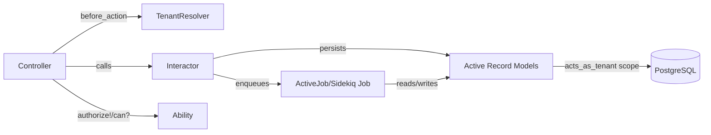

# Components

## TenantResolver (concern em ApplicationController)

**Responsibility:** Resolver `Shop` a partir de `params[:shop_slug]` e configurar `ActsAsTenant.current_tenant` via `set_current_tenant_through_filter`, retornando 404 para slugs inexistentes.

**Key Interfaces:** `before_action :set_current_shop`

**Dependencies:** `acts_as_tenant` gem, model `Shop`

## Interactors (`app/interactors/`)

**Responsibility:** Encapsular operações de escrita multi-step (`Shops::Register`, `Cart::AddItem`, `Checkout::CreateOrder`), cada uma em transação, retornando sucesso/falha via `Interactor::Result`.

**Key Interfaces:** `.call(context)` por convenção da gem `interactor`

**Dependencies:** Active Record models, `Ability` (quando a autorização precisa ser checada dentro do Interactor)

## Ability (`app/models/ability.rb`)

**Responsibility:** Única fonte de regras de autorização, consultada por `authorize!`/`can?` em controllers.

**Key Interfaces:** `Ability.new(user)`

**Dependencies:** `User#role`, `shop_id` dos recursos

## Background Jobs (`app/jobs/`)

**Responsibility:** Trabalho assíncrono (ex.: `OrderConfirmationJob`, `HealthCheckJob` de smoke-test), executado pelo processo `worker` via Sidekiq.

**Key Interfaces:** `ActiveJob::Base` subclasses com `queue_as`

**Dependencies:** Redis (broker), PostgreSQL (dados a processar)

## Component Diagram

