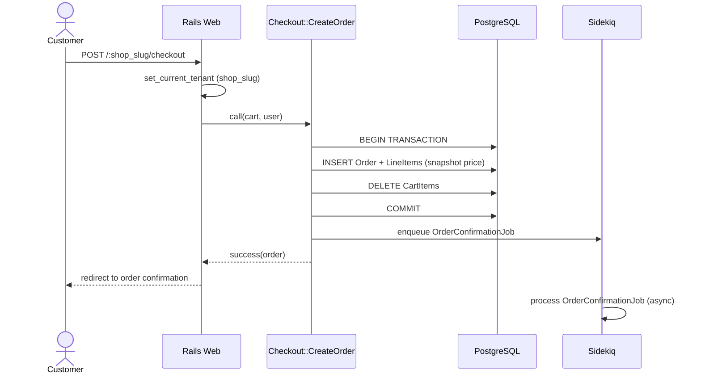

# Core Workflows

```mermaid
sequenceDiagram
    actor Customer
    participant Web as Rails Web
    participant Interactor as Checkout::CreateOrder
    participant DB as PostgreSQL
    participant Sidekiq

    Customer->>Web: POST /:shop_slug/checkout
    Web->>Web: set_current_tenant (shop_slug)
    Web->>Interactor: call(cart, user)
    Interactor->>DB: BEGIN TRANSACTION
    Interactor->>DB: INSERT Order + LineItems (snapshot price)
    Interactor->>DB: DELETE CartItems
    Interactor->>DB: COMMIT
    Interactor->>Sidekiq: enqueue OrderConfirmationJob
    Interactor-->>Web: success(order)
    Web-->>Customer: redirect to order confirmation
    Sidekiq->>Sidekiq: process OrderConfirmationJob (async)
```
