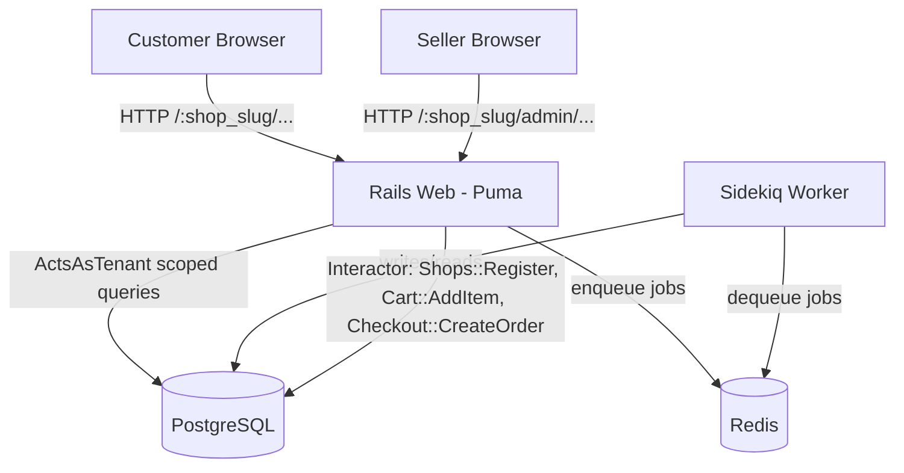

# High Level Architecture

## Technical Summary

A aplicação é um **monólito Rails 8 server-rendered** (ERB + Bootstrap + Turbo/Stimulus), com um processo web (Puma) e um worker assíncrono (Sidekiq) compartilhando a mesma base de código. Multi-tenancy é implementada via **isolamento de dados em linha** (`acts_as_tenant`, escopando toda query por `shop_id`), com o tenant resolvido a partir do segmento `:shop_slug` na URL — sem subdomínios. Autenticação é feita via Devise (modelo único `User` com `role` enum) e autorização via CanCanCan (`Ability` ramificando por `role` e validando `shop_id`). Lógica de negócio não-trivial é encapsulada em objetos `Interactor`. Todo dado de negócio persiste em PostgreSQL; Redis serve exclusivamente como broker do Sidekiq.

## High Level Overview

1. **Estilo arquitetural:** Monolito modular (não microsserviços, não serverless).
2. **Estrutura de repositório:** Monorepo — uma única aplicação Rails.
3. **Arquitetura de serviço:** Processo `web` (Puma, HTTP) + processo `worker` (Sidekiq, jobs assíncronos), ambos lendo o mesmo código-fonte e mesmo banco PostgreSQL; `redis` como broker compartilhado.
4. **Fluxo principal:** Cliente acessa `/:shop_slug/...` → `ApplicationController` resolve `Shop` pelo slug e seta `ActsAsTenant.current_tenant` → queries de models tenant-scoped (`Product`, `Cart`, `Order`) são filtradas automaticamente → escritas relevantes passam por um `Interactor` dedicado.
5. **Decisões-chave:** ver `../prd/technical-assumptions.md` — `acts_as_tenant` + roteamento por path.

## High Level Project Diagram

## Architectural and Design Patterns

- **Monolith (vs. Microservices/Serverless):** _Rationale:_ escopo "e-commerce simples" não justifica múltiplos serviços.
- **Row-level Multi-Tenancy via `acts_as_tenant`:** _Rationale:_ reduz risco de vazamento de dados sem o custo operacional de Apartment.
- **Interactor Pattern para lógica de negócio:** _Rationale:_ mandatado pelo usuário; mantém controllers magros e testáveis.
- **Repository implícito via Active Record + `acts_as_tenant` default_scope:** _Rationale:_ evita duplicar abstração.
- **Server-rendered MVC + Turbo Frames/Streams:** _Rationale:_ mandatado pelo usuário; evita API JSON separada no MVP.
